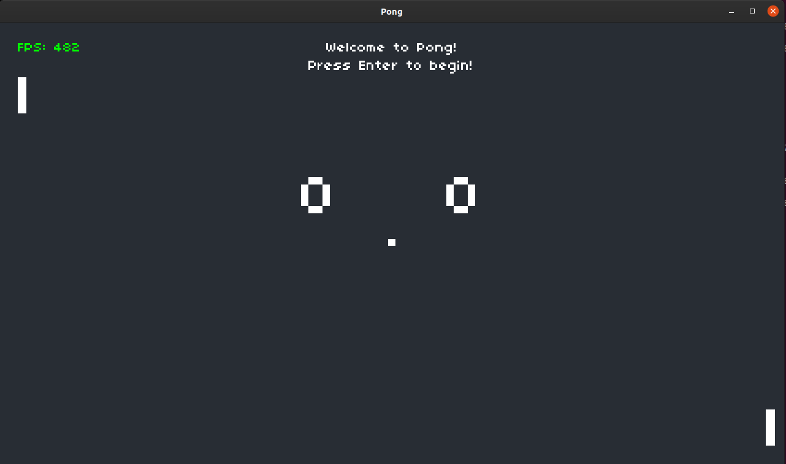

# Pong-Love2d
Pong game in Love2d

## How it looks


## Installation
To play the game, open your terminal and run the following commands
```
git clone https://github.com/kuruma99/Pong-Love2d.git
cd Pong-Love2d
love .
```

## Requirements
* Lua
* Love2D( v11.2)

## Highlights
- [x] Object Oriented Programming Style
- [x] Addition of different sounds for different collisions
- [x] Enabling resizing of windows
- [x] Score keeping up to 10 i.e. the winning score
- [x] Randomization of the speed to make the game interesting
- [x] Usage of different Font objects to display different things
- [x] usage of filter on the text to give it a more retro look

## Additional files that I have used
* **push.lua**
* **class.lua** 

## Customizations you can do
* Change the background **color** by specifying your (r,g,b) in _love.graphics.clear()_
* Create your own sound files using **bfxr** 

